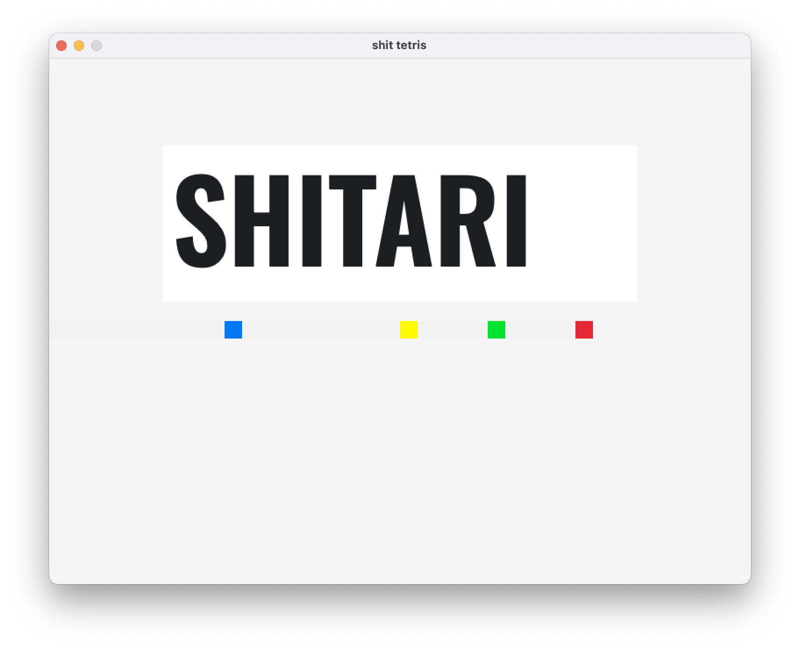
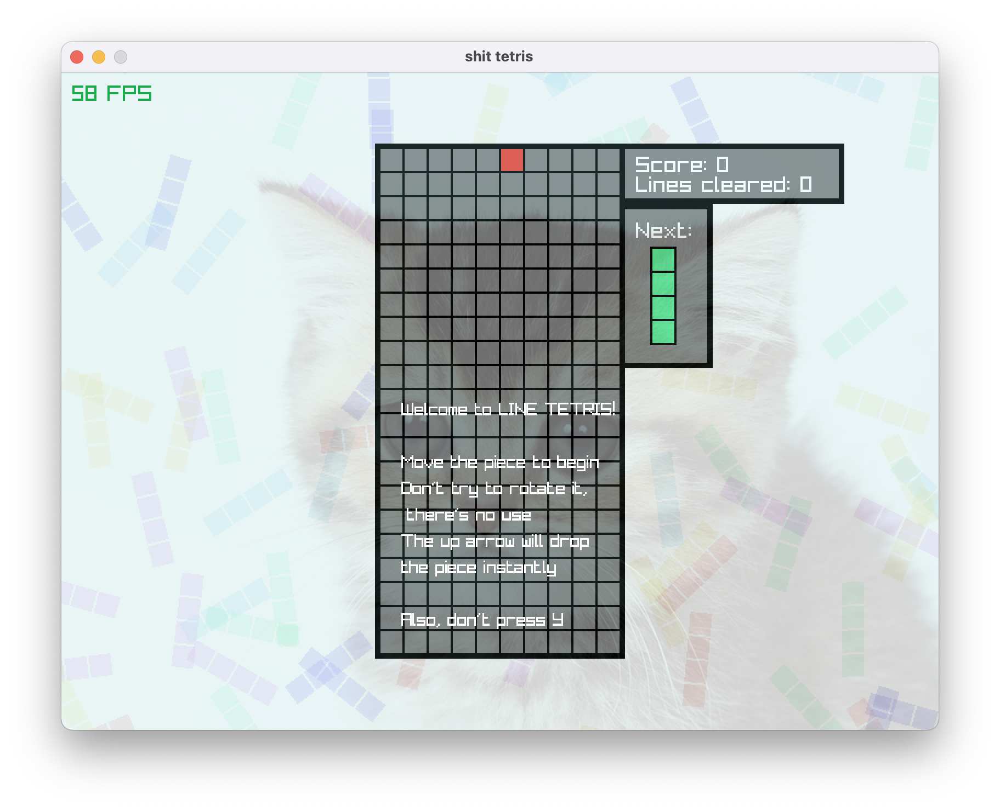

# Shit Tetris!



This project started off by a recommendation by my friend Josh Moskoff. The idea is that "it's Tetris, but only the vertical line piece". My friend Alma Zimberoff then gave me the idea to poorly recreate the Tetris music using my poor sequencing abilities. 

## Game
The game is very simple. The arrow keys move the piece left and right while the up arrow drops the piece immediately. With every completed line the "pieces" (line piece) drops faster. At a certain point the pieces drops so fast it's impossible to continue. 
There's no rotation. This made coding the game quite trivial and is why I was able to make it in just a day. The music is what took me the most time.



## Running the game
The game should be quite trivial to build through the use of cmake. This project is built using [raylib](https://github.com/raysan5/raylib). 
The CMakeLists includes instructions to automatically fetch, build, and link raylib into the shittetris project. No extra work should be needed.

To build, try running the following commands:
```
mkdir build
cd build
cmake ..
cmake --build .
```

At this point a `shittetris` executible file should be created. You should be fine to move this file, but make sure the `rsc` directory is in the same location as the executible at runtime or else it will fail to grab resources. 
This project was made very quickly. I don't know what will happen if it fails to find the resource files lol.

If these commands fail, check out the raylib github page. The most likely error is that your machine does not have the appropriate dependencies for raylib installed.

## Distributing the game
I wanted to share this with my girlfriend. 
I rather naively decided to zip up the debug executable with the `rsc` directory and send it to her.
Unsurprisingly, when she tried to run it, it didn't work. 
Her computer complained that she didn't have `ucrtbased.dll`, `VCRUNTIME140_1D.dll`, and `VCRUNTIME140D.dll`.

I could've talked her through installing the necessary tools to run this, but that's the cheap way. I wanted to do it right. I wanted an installer!

I decided on [Inno Installer](https://jrsoftware.org/isinfo.php). It was free, had good external editor support, and seemed to support the features I needed. To build the installer yourself, install the Inno Setup Compiler (I used version `6.2.1`), point it at `windowsinstall.iss`, and click Build > Compile. This should create the file `Output/mysetup.exe` which you can rename to anything and distribute as a standalone file. It's not signed correctly so anyone else running it will get a windows security notification. I don't care enough to get the file signed correctly.

Time to tackle those errors and include those dists in the installer! However, I come to learn these dlls are windows-specific dynamically linked libraries used for debuging c++ applications. They are automatically linked by my c++ build chain when running in debug mode. This confused me as I had run `cmake .. -DCMAKE_RELEASE_TYPE=Release`. 
Turns out that, on windows only, the release type is specified during the next step! I actually had to run `cmake --build . --config Release`. This is super annoying. 

I've said it in other projects, I'll say it again: fuck windows. Github: I know you're owned by Microsoft. I don't care. Fuck windows.

Anyways, once I made that change it correctly generated a release build of the game which access `VCRUNTIME140.dll` as opposed to the debug version that includes that extra `d` in the file name. She probably has these installed already anyways? But if not, I included the `VC_redist` in the installer and a mechanism I found on stackoverflow for detecting if the vc runtime is already installed. Now she won't need to install anything else!

So while the installer was mostly useless, it was fun to learn about and a great afternoon project.
